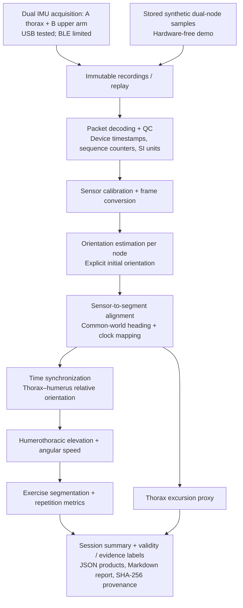
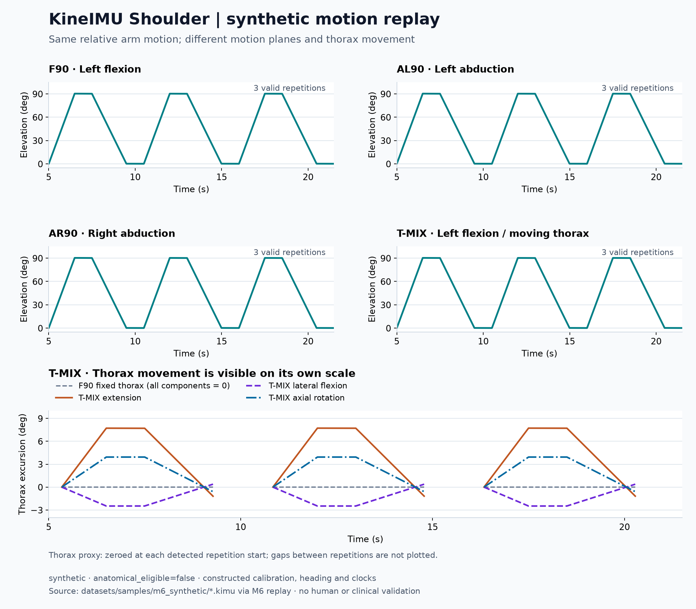

# KineIMU Shoulder

A hardware-tested dual-IMU research framework for shoulder rehabilitation movement
analysis. Two sensors measure upper-arm movement relative to a thorax reference.
It provides acquisition, calibration, quaternion orientation,
humerothoracic kinematics, exercise metrics and reproducible validation.
The complete hardware-free demo runs without devices.

KineIMU Shoulder 以胸廓为参考分析上臂运动，提供可追溯的采集、处理、指标与验证结果。
本项目用于研究，不是医疗诊断系统，也未建立人体运动精度或临床有效性。

## System data flow



The demo follows the stored synthetic input branch. Calibration, initial heading,
alignment and clocks are constructed assumptions; missing evidence keeps affected
metrics invalid. See [architecture](ARCHITECTURE.md) for frame and timing contracts.

## Synthetic motion preview



Actual M6 replay output from the [existing synthetic samples](datasets/samples/m6_synthetic/README.md),
including the moving-thorax case. Curves show **humerothoracic elevation** over the
5–21.5 s analysis window; radians are converted to degrees for display, with no
smoothing. The four cases share the same relative elevation profile; this scalar
does not distinguish flexion from abduction or left from right. The bottom panel
shows **T-MIX thorax excursion** on a separate scale, with stationary F90 as a
control. Its three components are relative to each detected repetition's starting
pose; gaps between repetitions are left blank. Thus similar relative arm curves
do not imply a stationary thorax.
These are **synthetic**, with `anatomical_eligible=false`, and do not
demonstrate human-motion accuracy or clinical outcomes.
See [figure provenance and reproduction](docs/assets/README.md).

## Quick start

Use CPython **3.12.14** and uv **0.12.5**:

```powershell
git clone https://github.com/TheSmashingPumpkinPies/KineIMU-Shoulder.git
cd KineIMU-Shoulder
uv sync --extra analysis --frozen
uv run --frozen python examples/m6_demo.py --output demo-output-01
```

Open `demo-output-01/summary.md`. The demo replays four stored synthetic trajectories:
flexion, left/right abduction and flexion with a moving thorax. Eight streams pass
through decoding/QC, calibration, orientation, alignment, synchronization and metrics.
A successful run exits 0 and produces 26 files with input/source/output hashes.
Use a new output directory for every run; failed partial outputs are preserved.
See [demo usage](docs/M6_DEMO.md) and [output contract](docs/M6_DEMO_CONTRACT.md).

The demo needs a repository clone, including Git, protocols, fixtures and samples.
Library packages provide analytical APIs rather than the complete repository demo.
Dependency installation needs network access or a populated cache. Windows is the
verified platform; Linux execution remains unverified. CI performs Linux checks when run.

## Capabilities and evidence

- Separate immutable dual-node recordings with timestamps, sequence counters and QC.
- Explicit SI units, frames, quaternion orientation, calibration and synchronization.
- Shoulder flexion and abduction: ROM, peak elevation, repetitions, movement/phase
  duration, holds, angular speed, repetition variability and thorax excursion proxy.
- Machine-readable results and summaries with validity reasons and evidence labels.

Physical acquisition validation passed on two Seeed Studio XIAO nRF52840 Sense
boards with LSM6DS3TR-C IMUs using dual USB. Hardware is frozen within V1 scope;
dual BLE throughput remains a documented limitation. M0–M6 are DONE within the
documented engineering boundary. This does not establish human or clinical accuracy.

Outputs describe **humerothoracic movement**, not glenohumeral or scapular angles.
Static gravity does not determine anatomical heading. Recorded shoulder metrics
remain null/invalid when timing, heading or anatomical alignment evidence is missing.
The default demo is synthetic with `anatomical_eligible=false`; its calibration,
alignment and clocks are constructed assumptions. Human-subject, motion-capture
and clinical validation, battery/enclosure and wearability are outside V1 scope.

## Documentation

| Reading route | Start here |
|---|---|
| Getting started | [Demo guide](docs/M6_DEMO.md), [sample inputs](datasets/samples/m6_synthetic/README.md) |
| System and methods | [Scope](PROJECT_SCOPE.md), [technical report](docs/M6_TECHNICAL_REPORT.md), [architecture](ARCHITECTURE.md), [metrics](docs/METRICS.md) |
| Validation and evidence | [Methods](VALIDATION.md), [coverage](docs/validation/coverage.md), [physical acquisition](docs/validation/acquisition.md), [historical benchmark](benchmarks/demo/REPORT.md) |
| Developer references | [Reproduction](docs/validation/reproduce.md), [data format](DATA_FORMAT.md), [backends](DEPENDENCIES.md), [M1–M5 contracts](protocols/), [M6 output contract](docs/M6_DEMO_CONTRACT.md) |
| Licensing and release | [Release status](docs/release/REVIEW.md), [packaging](docs/release/PACKAGING.md), [third-party notices](THIRD_PARTY_NOTICES.md), [public audit](docs/PUBLIC_AUDIT.md); exact grants below |

## Tests and builds

```powershell
uv sync --all-extras --frozen
uv run --frozen pytest
uv run --frozen ruff check .
uv run --frozen mypy
uv run --frozen mypy benchmarks/demo/run_benchmark.py
uv run --frozen python scripts/check_docs_consistency.py
uv build
```

Tests use temporary outputs outside the checkout. Two optional physical replay
tests require external M1 recordings; absence is reported as a skip.
Numerical changes require independent known-input tests and explicit units/frames.
Preserve raw records, failed results and upstream notices.

Repository/reserved CLI name: `kineimu-shoulder`; import: `kineimu_shoulder`.
The supported demo entry is the Python script; no console command is implemented.

## License and citation

Original project code and documentation: [MIT](LICENSE), Copyright (c) 2026
Hongbo Liao. Firmware and dependencies retain their respective licenses and
[full notices](THIRD_PARTY_NOTICES.md).
The original 25 demo input files retain their unchanged [CC0 permission](datasets/samples/m6_synthetic/LICENSE.md).
Additional retained original records have a separate [bounded grant](docs/PUBLIC_DATA_LICENSE.md).
No grant extends to software or third-party works.

Use [CITATION.cff](CITATION.cff) and cite Hongbo Liao, *KineIMU Shoulder*,
version 0.1.0 [software], with the exact revision and processing/input identities.
No DOI or release tag is declared.
